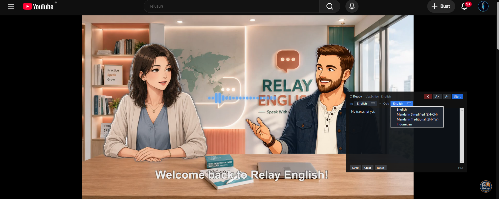

# VoxScribe

**Real-time speech transcription and translation overlay for Windows.**

VoxScribe captures your system audio output (loopback) or microphone, transcribes it offline using Whisper, translates it in real time, and displays the result as a draggable always-on-top subtitle overlay. Built for meetings, presentations, and multilingual conversations.

<p align="center">
  
  <br/>
  <em>Subtitle overlay in action — compact and full modes</em>
</p>

---

## Features

- **Always-on-top overlay** — draggable subtitle window with compact and full transcript modes
- **Offline speech recognition** — powered by faster-whisper (large-v3), no internet required for ASR
- **Real-time translation** — online translation via Google Translate (`deep-translator`)
- **Direct script conversion** — zh-cn ↔ zh-tw uses OpenCC directly, no online translator needed
- **Technology glossary** — 147 IT/engineering terms corrected after ASR (CI/CD, PostgreSQL, Kubernetes, OAuth, gRPC, etc.)
- **Hardware auto-tuning** — detects your specs and picks optimal compute profile (high/mid/low)
- **Hot-swap languages** — change input/output language mid-session without restarting transcription
- **Persistent transcript** — view, save to file, and clear transcript history
- **Local integration API** — optional HTTP server exposing runtime state, caption, and transcript endpoints
- **CJK-aware text wrapping** — proper line-breaking for mixed Latin and CJK characters

<p align="center">
  
  <br/>
  <em>Main window — language selection, audio source, and status controls</em>
</p>

## Supported Languages

| Role | Languages |
|------|-----------|
| **Input (ASR)** | English, Mandarin Simplified (zh-cn), Mandarin Traditional (zh-tw), Indonesian |
| **Output (Translation)** | English, Mandarin Simplified (zh-cn), Mandarin Traditional (zh-tw), Indonesian |
| **Auto-detect** | English, Mandarin Simplified, Indonesian |

## Quick Start

### Prerequisites

- **Windows 10/11** (loopback audio capture is Windows-only)
- **Python 3.10+**
- At least 8 GB RAM, ~6 GB free disk space

### Run

```bash
git clone https://github.com/T0MM11Y/VoxScribe.git
cd VoxScribe
python main.py
```

On first launch, the application will:
1. Check and auto-install missing dependencies
2. Run a system specification check
3. Download the Whisper model (~3 GB, one-time)
4. Warm up the audio loopback device
5. Show the subtitle overlay ready for capture

### Build Standalone EXE

```bash
python build_exe.py
```

Output: `dist/VoxScribe.exe` — a single-file Windows executable with no Python installation required.

## Keyboard Shortcuts

| Key | Action |
|-----|--------|
| `F5` | Start / Stop recognition |
| `Ctrl + S` | Save transcript to file |
| `Ctrl + Shift + C` | Toggle compact / full overlay mode |

## Architecture

```
main.py                      # Entry point, DPI awareness, crash logging
app/
  controller.py              # AppController alias
  ui/
    main_window.py           # Orchestrator: GUI, startup flow, state machine (2800+ lines)
    subtitle_overlay.py      # Always-on-top draggable overlay (1345 lines)
    dialogs.py               # Custom themed dialog boxes
  audio/
    capture.py               # Windows loopback / microphone capture via soundcard
  recognition/
    whisper_engine.py        # faster-whisper ASR with VAD, hallucination filtering, chunking
    model_manager.py         # Model lifecycle: download, cache, validation
  translation/
    service.py               # Async priority queue with caching, stale detection, OpenCC direct conversion
  services/
    transcript.py            # In-memory transcript storage and rendering
    glossary.py              # 147 IT term corrections via regex
    export.py                # Transcript file export
    language_switcher.py     # Hot-swap language facade
  core/
    config.py                # JSON config persisted to ~/.voxscribe/config.json
    languages.py             # Language registry, model specs, text transform strategies
    state.py                 # Thread-safe observable state container
  integration/
    openapi.py               # Local HTTP server with OpenAPI 3.1 spec
  system/
    profiler.py              # Hardware probe, auto-tuner, spec checker
tests/                       # 11 test modules covering all major subsystems
```

## Translation Pipeline

1. **Partial ASR** → displayed as source preview (no translation request sent)
2. **Final ASR** → accumulates in a stable buffer
3. **Buffer flushed** when any of these triggers fire:
   - Sentence-ending punctuation detected (`.`, `!`, `?`, `。`, `！`, `？`)
   - Ideal chunk size reached + short delay (`~450ms`)
   - Maximum characters exceeded (`96` for Latin, `180` for zh-en)
   - Maximum wait timeout (`~2200ms`, `~5200ms` for zh-en accuracy mode)
4. **Translated output** → overlay update + transcript entry

Default latency profile: `responsive`. Configurable in `app/core/config.py`.

## Testing

```bash
# Run all tests
python -m unittest discover -s tests

# Run a single test module
python -m unittest tests.test_translation_service
```

11 test modules covering: translation queue, glossary corrections, overlay layout, main window state machine, language config, OpenAPI integration, whisper engine, auto-tuner, transcript service, and more.

## Integration API (Optional)

When enabled in the config (`integration_api_enabled: true`), a local HTTP server starts on `http://127.0.0.1:8765`:

| Endpoint | Description |
|----------|-------------|
| `GET /health` | Server health check |
| `GET /openapi.json` | OpenAPI 3.1.0 specification |
| `GET /docs` | Swagger-style HTML documentation |
| `GET /runtime/snapshot` | Full runtime state snapshot |
| `GET /runtime/state` | Current application state |
| `GET /runtime/caption` | Current caption text and translation |
| `GET /runtime/transcript` | Full transcript history |

## Configuration

All settings are stored in `~/.voxscribe/config.json`. Notable options:

| Key | Default | Description |
|-----|---------|-------------|
| `input_language` | `en` | Source language for ASR |
| `output_language` | `en` | Target language for translation |
| `compute_device` | `cpu` | `cpu` or `cuda` |
| `audio_source_type` | `loopback` | `loopback` or `microphone` |
| `overlay_font_size` | `16` | Caption font size (10–28) |
| `overlay_compact` | `true` | Compact overlay mode default |
| `integration_api_enabled` | `false` | Enable local HTTP API |

## Troubleshooting

| Problem | Solution |
|---------|----------|
| Startup fails | Ensure Windows audio output is active and playing sound |
| NumPy 2.x error | Install `numpy<2` |
| Chinese Traditional issues | Install `opencc-python-reimplemented` |
| Translation empty | Check internet connection |
| Model download slow | Model is ~3 GB; wait for the one-time download to complete |

## Tech Stack

- **ASR**: [faster-whisper](https://github.com/SYSTRAN/faster-whisper) (CTranslate2)
- **Translation**: [deep-translator](https://github.com/nidhaloff/deep-translator) (Google Translate)
- **UI**: [CustomTkinter](https://github.com/TomSchimansky/CustomTkinter)
- **Audio capture**: [soundcard](https://github.com/bastibe/soundcard)
- **Script conversion**: [opencc-python-reimplemented](https://github.com/yichen0831/opencc-python)
- **Build**: PyInstaller (single-file EXE, excludes torch/transformers/tensorflow)

## License

MIT
